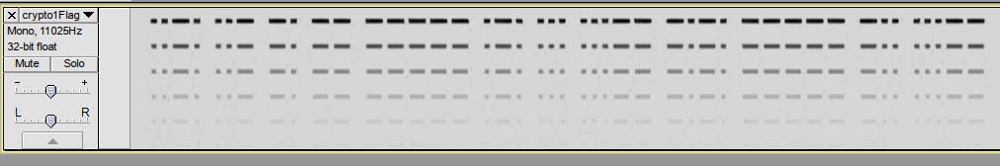

## Easy Crypto - IDSECCONF 2014

**Category:** Crypto
**Points:** 100

### Write-up

In this problem, we were given this string :

> 5232467249484e6c6258566b59576767615852314947316863794269636d3873494735706143426f644852774f6938765a4777755a484a7663474a766543356a62323076637938794e476b786133453265574e7662326878616d777659334a35634852764d555a73595763756258417a

We found that these string maybe a hex ascii code, because there are alphabets and numbers on it.
After using some online converter tools, these string became :

> R2FrIHNlbXVkYWggaXR1IG1hcyBicm8sIG5paCBodHRwOi8vZGwuZHJvcGJveC5jb20vcy8yNGkxa3E2eWNvb2hxamwvY3J5cHRvMUZsYWcubXAz

Actually, the second string has "==" at the end of it, but i just try to recall the writer's purpose because i forgot to save the real string.

So, because there was a "==" at the string we try to decode it with online base64 decoding. The result is :

> Gak semudah itu mas bro, nih http://dl.dropbox.com/s/24i1kq6ycoohqjl/crypto1Flag.mp3

Yeay, we've found the link.

After we downloaded it, we found that it was a Morse code.
You can check it [here](crypto1Flag.mp3)

Now, to finish this task
we run the morse code in Audacity, select Pitch(EAC) for analysis and set rate to 11025Hz.



The song now become the real Morse code
```bash
..-. ..- -. -- ----- .-. ... ...-- -.-. ----- -.. ...--
```

After we translated the morse code, the string is :

> FUNM0RS3C0D3

So, that's the Flag :)
