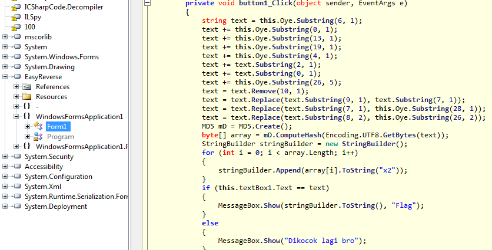

## Easy Reverse - IDSECCONF 2014

**Category:** Reverse
**Points:** 100

### Write-up

In this problem, we were given an executable file. So we checked the file first

```bash
$ file EasyReverse.exe
EasyReverse.exe: PE32 executable (GUI) Intel 80386 Mono/.Net assembly, for MS Windows
```

So it's a .Net program. Because the problem is about reverse, we loaded up the ILSpy to reverse these program.

After trying to found the 'real' code, we found this interesting method



From that method, we know that the Flag was stored in `stringBuilder` variable.

To solve this problem, we just print the `stringBuilder` variable

You can see the code in [here](http://ideone.com/9aca5A)

After we printed the `stringBuilder`, the flag is

> 9bd03cfdfe10124755e2a051288c6dda

Actually we found that the flag is the MD5 of 'ganteng2014'

So, that's the Flag :)
