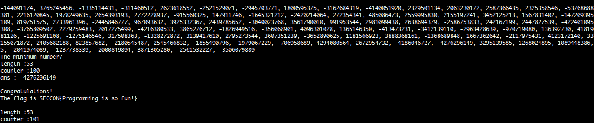

## Programming - SECCON 2014

**Category:** Programming
**Points:** 100

> 

### Write-up

We were given a service that running some program that ask for answer at `number.quals.seccon.jp 31337`

```bash
$ nc number.quals.seccon.jp 31337
0, 5
The maximum number? asdasd
Wrong, bye.
```

Using netcat we found an interesting program, actually it just ask a bunch of numbers and we were asked for the maximum or the minimum number from the list of numbers.
A couple hours (trial and error), we tried to code a Python program to simulate and solve the task automatically and came up with this solver script :D

```python
import socket

def convert(x):
    p = []
    x = x.split(",")
    for i in x:
        p.append(int(i))
    return p

def solve(num, stat):
    if "max" in stat:
        tmp = num[0]

        for i in num:
            if tmp < i:
                tmp = i
    if "min" in stat:
        tmp = num[0]
        for i in num:
            if tmp > i:
                tmp = i
    return tmp

s = socket.create_connection(("number.quals.seccon.jp", 31337))
c = 1

while True:
    r = s.recv(100024)
    print(r.decode())
    print("length :"+str(len(str(r.decode))))
    print("counter :"+str(c))
    c = c + 1
    if "bye" in r.decode():
        print("gagal")
        break
    if "\n" in r.decode():
        num, stat = r.decode().split("\n")
        xx = str(solve(convert(num), stat))+"\n"
        print("ans : "+str(xx))
        s.send(bytes(xx, 'utf-8'))
```

So, we run the script and saw it until the counter hit 100 and found the flag \ ^^ /



So, that's the flag :)

Actually at the first attempt, we were failed at the 89th task and tried to make the `recv` buffer a little bigger.
