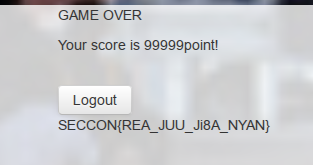

## REA-JUU WATCH - SECCON 2014

**Category:** Web
**Points:** 200

> 

### Write-up

We were given a web that runs like a visual novel alike.
Choose some action, and you'll get another action and all the action you chose will be calculate to get the score.

We're tried several attempts and got bored. We saw some captured header on the LiveHTTP Header and found an interesting url at `http://reajuu.pwn.seccon.jp/users/chk/14303`. We tried to change the `14303` to another number, we found a JSON response that contains a username,password and also the score. After several attempts, we found a convincing accoung when we changed the user id to `1`.

We try to log in to the web with that account and played the game. And on the last page we found the flag :D

So, that's the flag :)

This bug somehow also still happened on some websites that we've visited online. The bug happened because the developer didn't authenticate a valid user when accessing their websites. It should have some authentication method (cookies, session, etc) to validate the user's action on their website. 

As a developer, the first thing to remember is DON'T TRUST YOUR USER'S INPUT :)